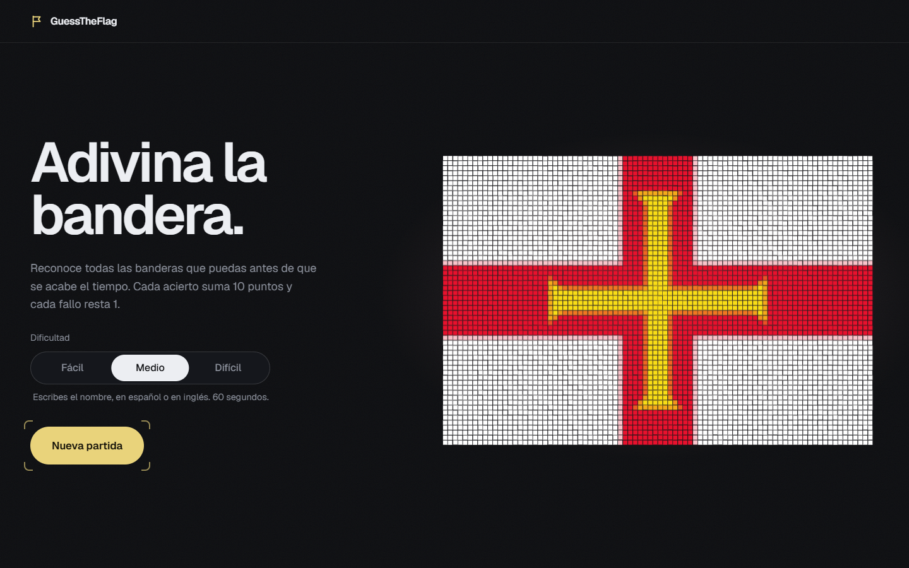
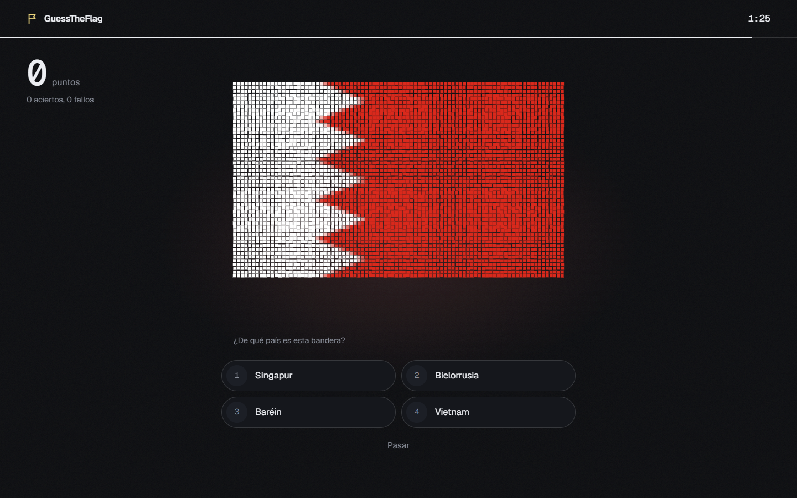
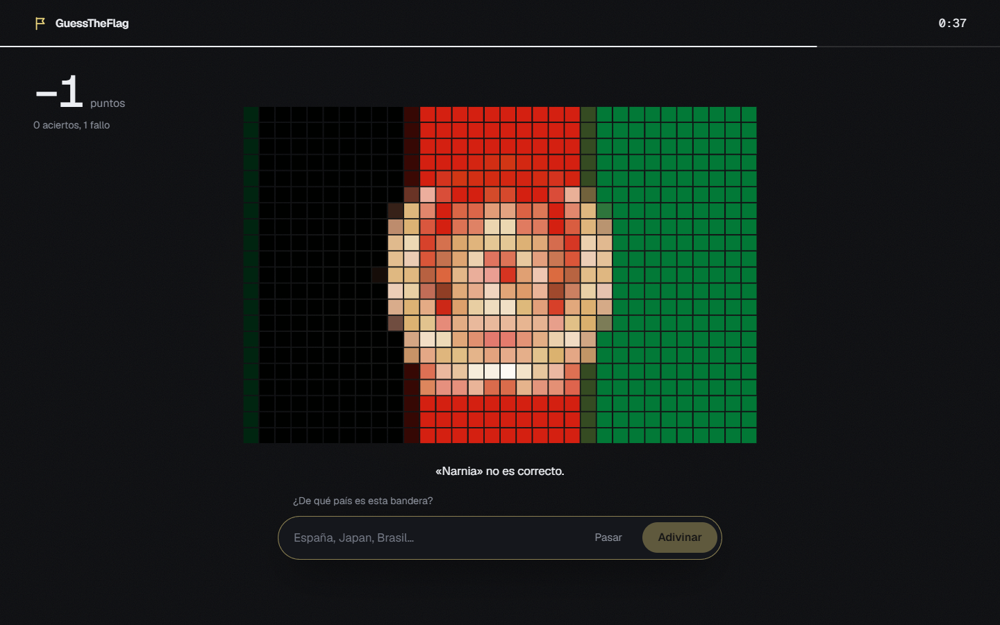

<div align="center">


# GuessTheFlag

**Adivina la bandera antes de que se acabe el tiempo.**<br />
Banderas hechas de partículas que reaccionan a tu cursor. En español o en inglés.

<br />


<br />



</div>

<br />

## El juego

Aparece una bandera. Escribe de qué país es, o elígelo entre cuatro opciones, antes de que el reloj llegue a cero.

|  |  |
|---|---|
| **Acierto** | +10 puntos y pasa a otra bandera |
| **Fallo** | −1 punto y sigues con la misma |
| **Pasar** | −1 punto, te muestra el país y salta a otra |

Las mayúsculas y las tildes no importan, y se acepta el nombre en español o en inglés: `Alemania`, `germany` y `ALEMANIA` valen igual.

### Tres dificultades

| | Cómo respondes | Tiempo | La bandera |
|---|---|---|---|
| **Fácil** | Eliges entre 4 países, con clic o con las teclas `1` a `4` | 90 s | Nítida |
| **Medio** | Escribes el nombre | 60 s | Nítida |
| **Difícil** | Escribes el nombre | 45 s | Pixelada |

Cada dificultad tiene su propio ranking con las 10 mejores puntuaciones.

<br />

<div align="center">


</div>

<br />

## Lo que lo hace especial

- **Banderas de partículas.** Cada bandera es un mosaico de miles de cuadrados con física de muelle. El cursor las aparta, al acertar estallan y se recomponen en la siguiente, y al fallar tiemblan.
- **Luz ambiente.** El fondo se tiñe con el color medio de la bandera que tienes delante.
- **Bilingüe sin tablas de traducción.** Los nombres en español salen de `Intl.DisplayNames`, que ya incluye el navegador, a partir del código ISO de cada país.
- **Accesible.** Se maneja entero con teclado, usa controles nativos, anuncia los resultados a lectores de pantalla y respeta `prefers-reduced-motion`: con esa opción activada la bandera se dibuja estática.
- **Responsive.** Funciona desde móvil hasta pantallas grandes.
- **Sin backend.** El ranking y la última dificultad se guardan en `localStorage`.

## Empezar

Necesitas [Node.js](https://nodejs.org) 20.19 o superior (o 22.12+).

```bash
git clone <url-del-repositorio>
cd GuessTheFlag
npm install
npm run dev
```

Abre <http://localhost:5173>.

| Comando | Qué hace |
|---|---|
| `npm run dev` | Servidor de desarrollo con recarga en caliente |
| `npm run build` | Comprueba los tipos y genera la versión final en `dist/` |
| `npm run preview` | Sirve la versión final para probarla |
| `npm run lint` | Revisa el código con ESLint |

## Tecnologías

| | |
|---|---|
| **React 19** y **TypeScript** | Interfaz y tipado |
| **Vite** | Servidor de desarrollo y empaquetado |
| **Canvas 2D** | Motor propio de partículas, sin librerías de gráficos |
| **axios** | Petición a la API de banderas |
| **CSS** | Estilos a mano, sin frameworks. Tipografías Geist y Geist Mono |
| [countriesnow.space](https://countriesnow.space) | Origen de los nombres y las imágenes de las banderas |

## Estructura

```
src/
├── App.tsx                 Pantallas: portada, partida y resultado
├── Context/                Estado y lógica del juego (React Context)
├── components/
│   ├── Flag/               Bandera de partículas y su motor (particleField.ts)
│   ├── GuessForm/          Campo de texto o las 4 opciones del modo fácil
│   ├── DifficultyPicker/   Selector de dificultad
│   ├── ScoreBoard/         Marcador
│   ├── Timer/              Cuenta atrás
│   ├── Leaderboard/        Ranking
│   └── NewGameButton/      Botón de empezar
├── services/flagApi.ts     Llamada a la API
└── utils/country.ts        Comparar respuestas, traducir nombres, azar
```

## Documentación

- **[Guía técnica](docs/ARCHITECTURE.md):** cómo encaja todo, qué hace cada archivo, cómo funciona el motor de partículas y dónde tocar para cambiar cosas.
- **[Decisiones de diseño](DESIGN.md):** concepto visual, colores, tipografía y animaciones.

## Personalizar

Los ajustes más habituales están en [`src/Context/GameContext.ts`](src/Context/GameContext.ts):

```ts
export const POINTS_HIT = 10   // puntos por acierto
export const POINTS_MISS = 1   // puntos que se restan por fallo

export const DIFFICULTIES = {
  facil:   { seconds: 90, answer: 'choices', particles: 5200 },
  medio:   { seconds: 60, answer: 'text',    particles: 5200 },
  dificil: { seconds: 45, answer: 'text',    particles: 700  }, // menos partículas = más pixelada
}
```

El color de acento y las fuentes se cambian en [`src/index.css`](src/index.css) y el comportamiento de las partículas en [`particleField.ts`](src/components/Flag/particleField.ts).

## Créditos

Las banderas proceden de Wikimedia Commons, servidas a través de la API de [countriesnow.space](https://countriesnow.space).
