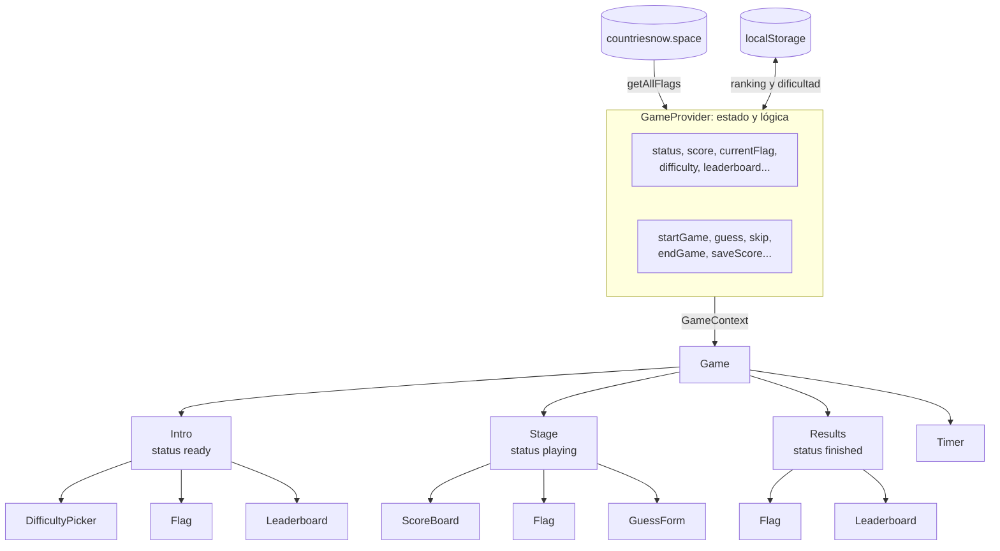

# GuessTheFlag: guía técnica

> Explicación del código para leerlo y entenderlo. Volver al [README](../README.md).
Juego web para adivinar banderas. Aparece una bandera y tienes que decir de qué
país es antes de que se acabe el tiempo: **cada acierto suma 10 puntos y cada
fallo resta 1**. Se puede responder en español o en inglés y hay tres
dificultades.

Hecho con **React 19 + TypeScript + Vite**. Las banderas vienen de la API
pública [countriesnow.space](https://countriesnow.space).

---

## Índice

1. [Cómo ejecutarlo](#cómo-ejecutarlo)
2. [Cómo se juega](#cómo-se-juega)
3. [Mapa de carpetas](#mapa-de-carpetas)
4. [Cómo encaja todo](#cómo-encaja-todo)
5. [El estado del juego (Context)](#el-estado-del-juego-context)
6. [Archivo por archivo](#archivo-por-archivo)
7. [El motor de partículas](#el-motor-de-partículas)
8. [Estilos](#estilos)
9. [Recetas: cómo cambiar cosas](#recetas-cómo-cambiar-cosas)
10. [Conceptos de React usados](#conceptos-de-react-usados)

---

## Cómo ejecutarlo

```bash
npm install      # solo la primera vez
npm run dev      # arranca en http://localhost:5173
npm run build    # comprueba los tipos y genera la versión final en dist/
npm run lint     # revisa el código con ESLint
```

---

## Cómo se juega

| Modo | Cómo respondes | Tiempo | Bandera |
|---|---|---|---|
| Fácil | Eliges entre 4 países (clic o teclas 1 a 4) | 90 s | Nítida |
| Medio | Escribes el nombre | 60 s | Nítida |
| Difícil | Escribes el nombre | 45 s | Pixelada |

- **Acierto:** +10 puntos y pasa a otra bandera.
- **Fallo:** −1 punto y sigues con la misma.
- **Pasar:** −1 punto, te dice qué país era y pasa a otra.
- Las mayúsculas y las tildes no importan: `peru`, `Perú` y `PERU` valen igual.
- Al terminar puedes guardar tu nombre en el ranking. Cada modo tiene el suyo.

---

## Mapa de carpetas

```
src/
├── main.tsx                 Punto de entrada: monta <App /> en la página
├── App.tsx                  Las pantallas (portada, partida, resultado)
├── App.css                  Estilos de esas pantallas
├── index.css                Estilos globales y colores (variables CSS)
│
├── Context/
│   ├── GameContext.ts       Tipos, constantes, dificultades y el hook useGame()
│   └── GameProvider.tsx     El "cerebro": estado y lógica del juego
│
├── services/
│   └── flagApi.ts           Llamada a la API de banderas (axios)
│
├── utils/
│   └── country.ts           Comparar respuestas, traducir nombres, azar
│
└── components/              Piezas visuales. Cada una tiene su index.tsx y su .css
    ├── Flag/                Bandera de partículas
    │   └── particleField.ts El motor de partículas (canvas, sin React)
    ├── GuessForm/           Campo de respuesta / las 4 opciones del modo fácil
    ├── ScoreBoard/          Marcador
    ├── Timer/               Cuenta atrás
    ├── Leaderboard/         Ranking
    ├── DifficultyPicker/    Selector de dificultad
    └── NewGameButton/       Botón "Nueva partida"
```

Otros archivos de la raíz:

- `index.html`: la página base. Carga las fuentes (Geist) y `src/main.tsx`.
- `DESIGN.md`: decisiones de diseño (colores, tipografías, animaciones).
- `.claude/skills/`: skills de Claude Code instaladas para el proyecto. No forman parte de la app.

---

## Cómo encaja todo



La idea clave: **los datos fluyen hacia abajo y las acciones hacia arriba.**

1. `GameProvider` guarda todo el estado y lo comparte con `GameContext`.
2. Las pantallas (`Intro`, `Stage`, `Results`) lo leen con `useGame()`.
3. Los componentes pequeños (`Flag`, `ScoreBoard`...) **no** usan el contexto:
   reciben lo que necesitan por props. Así son reutilizables y fáciles de entender.
4. Cuando el jugador hace algo, el componente llama a una función recibida por
   props (por ejemplo `onGuess`), que acaba en una acción del provider (`guess`).
   El provider cambia el estado y React vuelve a pintar lo necesario.

### Ejemplo: qué pasa al escribir "Francia" y pulsar Adivinar

1. `GuessForm` llama a `onGuess("Francia")`.
2. En `Stage`, `onGuess` es la función `guess` de `useGame()`.
3. `guess` (en `GameProvider`) normaliza el texto y lo compara con los nombres
   válidos de la bandera actual (inglés y español).
4. Si acierta: `score + 10`, `hits + 1`, nueva bandera y `lastGuess = { outcome: 'hit', ... }`.
5. React vuelve a pintar `Stage` con los datos nuevos:
   - `Flag` recibe otra `src` → las partículas estallan y forman la bandera nueva.
   - `ScoreBoard` recibe otro `score` → el número rueda y aparece "+10".
   - El mensaje muestra "Correcto, era Francia."

---

## El estado del juego (Context)

Todo el estado vive en `GameProvider.tsx` y se comparte con un **contexto** de React.

```tsx
// En cualquier componente que esté dentro de <GameProvider>:
const { score, currentFlag, guess } = useGame()
```

### Qué guarda

| Dato | Tipo | Para qué |
|---|---|---|
| `status` | `'loading' \| 'error' \| 'ready' \| 'playing' \| 'finished'` | Qué pantalla se ve |
| `flags` | `FlagData[]` | Todas las banderas de la API |
| `difficulty` | `'facil' \| 'medio' \| 'dificil'` | Modo elegido |
| `currentFlag` | `FlagData \| null` | Bandera en pantalla |
| `choices` | `string[]` | Las 4 opciones del modo fácil |
| `score`, `hits`, `misses` | `number` | Marcador |
| `lastGuess` | `GuessResult \| null` | Último intento: mensaje y animaciones |
| `gameId` | `number` | Sube en cada partida; reinicia el Timer |
| `leaderboard` | `LeaderboardEntry[]` | Ranking (todos los modos) |

### Acciones

| Acción | Qué hace |
|---|---|
| `setDifficulty(modo)` | Cambia el modo y lo recuerda en localStorage |
| `startGame()` | Marcador a cero, primera bandera, reloj en marcha |
| `guess(texto)` | Comprueba la respuesta (+10 o −1) |
| `skip()` | Pasa de bandera (−1) y revela el país |
| `replaceFlag()` | Si una imagen no carga, la descarta sin penalizar |
| `endGame()` | Fin de la partida (lo llama el Timer al llegar a 0) |
| `saveScore(nombre)` | Guarda la puntuación en el ranking del modo |
| `goHome()` | Vuelve a la portada |

### Ciclo de vida

```
loading ──API ok──▶ ready ──startGame()──▶ playing ──endGame()──▶ finished
   │                  ▲                       ▲                       │
   └─API falla─▶ error └───── goHome() ───────┼───────────────────────┤
                                              └──── startGame() ──────┘
```

---

## Archivo por archivo

### `src/main.tsx`
Lo primero que se ejecuta. Monta `<App />` en el `<div id="root">` de
`index.html` y carga `index.css`.

### `src/App.tsx`
Contiene las pantallas. Cada una es un componente pequeño en el mismo archivo:

- **`App`**: envuelve todo en `<GameProvider>`.
- **`Game`**: el marco común (navegación, luz de fondo, Timer). Según `status`
  muestra una pantalla u otra. Guarda en `glow` el color medio de la bandera
  visible para teñir la luz de fondo.
- **`Intro`**: portada con el titular, el selector de dificultad, el botón de
  empezar, una bandera de muestra que cambia cada 3,6 s y el ranking del modo.
- **`Stage`**: la partida (marcador, bandera, mensaje y respuesta). En el modo
  fácil le pasa `choices` a `GuessForm`.
- **`Results`**: puntuación final, guardar nombre, última bandera y ranking.

### `src/Context/GameContext.ts`
Solo **definiciones**, sin lógica:
- Tipos (`FlagData`, `GameStatus`, `GuessResult`, `Difficulty`...).
- Constantes: `POINTS_HIT`, `POINTS_MISS` y `DIFFICULTIES` (los ajustes de cada modo).
- `GameContext` (el contexto) y `useGame()` (el hook para leerlo).

### `src/Context/GameProvider.tsx`
El **cerebro**. Pide las banderas a la API al arrancar, guarda el estado con
`useState` y define las acciones (tabla de arriba). También lee y escribe
`localStorage` para el ranking y la última dificultad.

### `src/services/flagApi.ts`
Una sola función, `getAllFlags()`, que hace `GET /flag/images` con axios y
devuelve la lista `[{ name, flag, iso2, iso3 }]`.

### `src/utils/country.ts`
Funciones puras (sin React):

| Función | Qué hace |
|---|---|
| `normalize(texto)` | Quita tildes, pasa a minúsculas y recorta espacios |
| `spanishName(bandera)` | Nombre en español a partir del código ISO, con `Intl.DisplayNames` (viene en el navegador, no hace falta traducir a mano) |
| `acceptedNames(bandera)` | Respuestas válidas: nombre en inglés y en español, normalizados |
| `makeChoices(banderas, correcta)` | 4 opciones barajadas para el modo fácil |
| `pickRandom(banderas, anterior)` | Bandera al azar distinta de la anterior |

### Componentes

| Componente | Props principales | Qué hace |
|---|---|---|
| `Flag` | `src`, `particles`, `transition`, `missKey`, `onColor`, `onLoadError`, `label` | Dibuja la bandera con partículas. Ver [el motor](#el-motor-de-partículas) |
| `GuessForm` | `onGuess`, `onSkip`, `shakeKey`, `choices` | Campo de texto o 4 botones. Solo envía la respuesta, no sabe si es correcta |
| `ScoreBoard` | `score`, `hits`, `misses`, `change` | Marcador con número que rueda y "+10"/"−1" flotante |
| `Timer` | `seconds`, `running`, `onTimeUp` | Cuenta atrás. Se reinicia cambiándole la `key` |
| `Leaderboard` | `entries`, `mode` | Lista ordenada de puntuaciones |
| `DifficultyPicker` | `value`, `onChange`, `disabled` | Interruptor de 3 posiciones (radios nativos) |
| `NewGameButton` | `onClick`, `disabled`, `label` | Botón de empezar con esquinas de visor |

---

## El motor de partículas

`src/components/Flag/particleField.ts` es la parte más técnica. Es una clase de
TypeScript normal (no un componente) que dibuja en un `<canvas>`.

**La idea:** la bandera se divide en una rejilla de unos 5.200 cuadraditos
(700 en difícil). Cada cuadradito es una partícula con:

- una **casa**: su sitio en la rejilla (`hx`, `hy`);
- una **posición** y una **velocidad** (`x`, `y`, `vx`, `vy`);
- un **color**, tomado de la bandera.

**En cada fotograma** (`step`):

```
aceleración = (casa − posición) × SPRING      ← un muelle que la atrae a casa
            + empujón del cursor si está cerca ← REPEL_RADIUS / REPEL_FORCE
velocidad   = (velocidad + aceleración) × DAMPING   ← rozamiento
posición    = posición + velocidad
```

**Sacar los colores** (`sample`): la imagen se dibuja en un canvas invisible
del mismo tamaño que la rejilla (por ejemplo 88×59 píxeles). Así cada píxel es
el color de una partícula. Para leer píxeles de una imagen de otro dominio, el
servidor tiene que permitir CORS. Wikimedia lo permite y por eso la imagen se
carga con `crossOrigin = 'anonymous'`.

**Al cambiar de bandera** (`apply` con `'strong'` o `'soft'`): cada partícula
recibe un impulso hacia fuera desde el centro, y a mitad de vuelo cambia al
color nuevo (`swapAt`). El muelle las devuelve a casa y aparece la bandera nueva.

**Rendimiento:**
- Los datos van en arrays tipados (`Float32Array`), uno por propiedad, mucho
  más rápidos que un array de objetos.
- La animación se para sola cuando todo está quieto y se reanuda con `kick()`.
- Con `prefers-reduced-motion` activado en el sistema, la bandera se dibuja
  estática, sin animaciones.

**Cómo lo usa React** (`Flag/index.tsx`): crea el motor una vez en un
`useEffect`, lo guarda en un `useRef` y, cuando cambian las props, le da
órdenes: `setImage()`, `tremble()`, `setDensity()`. Un `ResizeObserver` le avisa
cuando cambia el tamaño.

---

## Estilos

- **CSS normal**: cada componente importa su propio `.css`. No hay Tailwind.
- **Nombres de clase tipo BEM**: `bloque__elemento--variante`, por ejemplo
  `guess__submit` o `stage__feedback--hit`. Así es fácil saber a qué componente
  pertenece cada regla.
- **Colores y fuentes** como variables en `src/index.css`:

| Variable | Valor | Uso |
|---|---|---|
| `--bg` | `#0c0d10` | Fondo |
| `--surface`, `--surface-2` | `#15171c`, `#1c1f26` | Campos y botones |
| `--text` | `#eceef2` | Texto principal |
| `--muted` | `#8a8f9a` | Texto secundario |
| `--accent` | `#e9d37b` | Único color de acento (amarillo) |
| `--sans`, `--mono` | Geist, Geist Mono | Tipografías |

- La luz de fondo usa `--glow`, que `Game` actualiza con el color medio de la
  bandera visible.
- Todo responde a pantallas pequeñas (`@media (max-width: ...)`) y respeta
  `prefers-reduced-motion`.

---

## Recetas: cómo cambiar cosas

| Quiero... | Dónde |
|---|---|
| Cambiar los puntos por acierto o fallo | `POINTS_HIT` / `POINTS_MISS` en `Context/GameContext.ts` |
| Cambiar el tiempo o la pixelación de un modo | `DIFFICULTIES` en `Context/GameContext.ts` (`seconds`, `particles`) |
| Añadir un modo nuevo | Añádelo a `Difficulty`, `DIFFICULTIES` y `DIFFICULTY_ORDER` en el mismo archivo |
| Cambiar el número de opciones del modo fácil | Parámetro `count` de `makeChoices` en `utils/country.ts` |
| Aceptar apodos ("EEUU", "Holanda") | Amplía `acceptedNames` en `utils/country.ts` con una lista de alias |
| Guardar más de 10 puntuaciones por modo | `MAX_ENTRIES` en `Context/GameProvider.tsx` |
| Cambiar el color de acento | `--accent` en `src/index.css` |
| Cambiar cómo reaccionan las partículas al cursor | `REPEL_RADIUS` y `REPEL_FORCE` en `Flag/particleField.ts` |
| Borrar el ranking | En la consola del navegador: `localStorage.removeItem('guesstheflag:leaderboard')` |

---

## Conceptos de React usados

| Concepto | Dónde se ve | En una frase |
|---|---|---|
| `useState` | Casi todos los componentes | Guarda un valor; al cambiarlo, React vuelve a pintar |
| `useEffect` | Provider (cargar API), Timer, Flag | Código que se ejecuta después de pintar (peticiones, temporizadores, eventos) |
| `useContext` | `useGame()` en `GameContext.ts` | Lee datos compartidos sin pasarlos por props |
| `useCallback` | Acciones del Provider | Mantiene la misma función entre renders mientras no cambien sus dependencias |
| `useRef` | Flag, ScoreBoard, Timer, GuessForm | Guarda algo que no debe provocar un render: un elemento del DOM, el motor, el último callback |
| `useLayoutEffect` | ScoreBoard | Como `useEffect`, pero antes de que se vea en pantalla (evita un parpadeo) |
| `key` para reiniciar | `<Timer key={gameId}>`, `<GuessForm key={...}>` | Si cambia la `key`, React crea el componente de cero |
| Estado derivado | `missKey`, `change` en `Stage` | Valores que se calculan de otros en cada render, sin guardarlos aparte |
